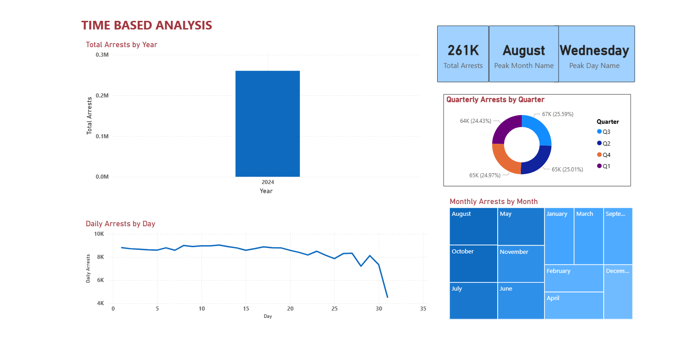
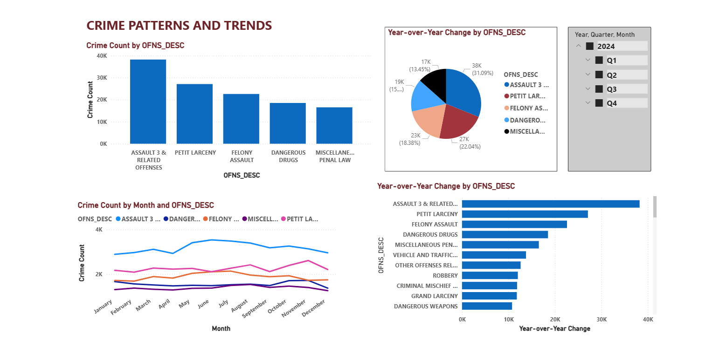
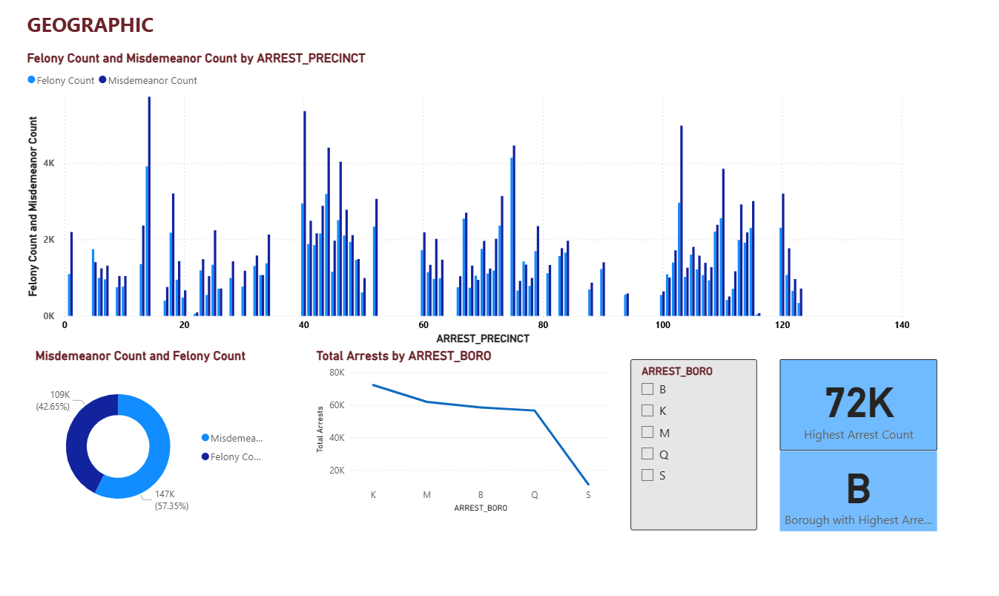
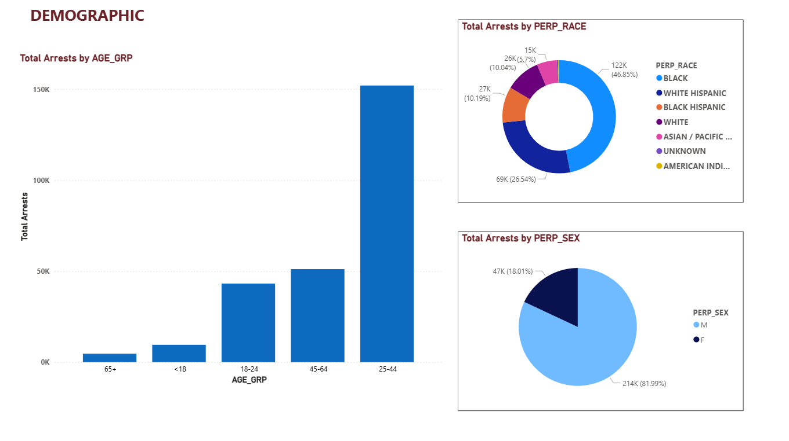
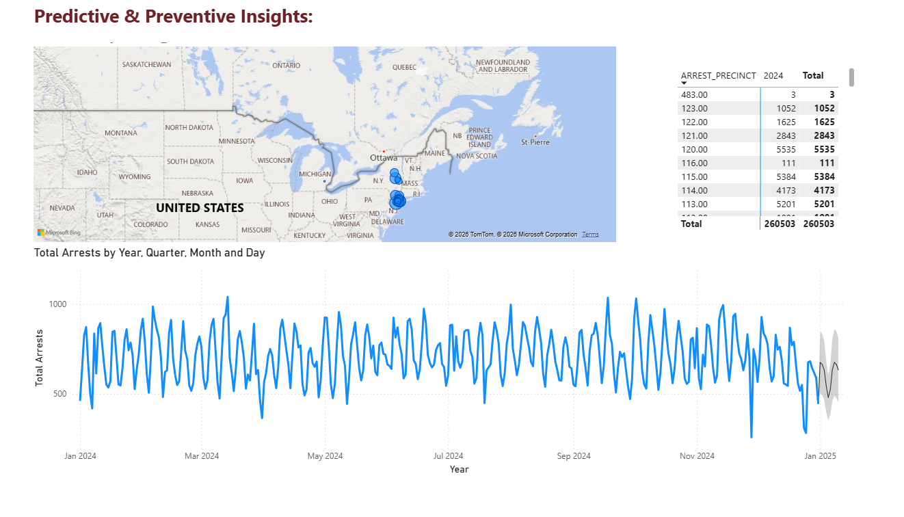

# NYPD Arrest Data Analysis and Visualization Project

## Overview
This project analyzes NYPD arrest data through a complete data pipeline, from initial data acquisition to final visualization. The pipeline includes data profiling, cleaning, dimensional modeling, data warehousing in Snowflake, and visualization with Power BI.

## Project Architecture

**End-to-End Process:**
1. Raw NYPD arrest data acquisition
2. Data profiling and cleaning with Alteryx
3. Dimensional model design
4. Stage tables creation and loading to Snowflake
5. Fact and dimension tables creation using Azure Data Factory
6. Final data warehouse in Snowflake
7. Interactive visualizations in Power BI

## Key Components

### 1. Data Acquisition and Profiling
- **Source:** NYPD arrest dataset
- Initial data profiling to understand structure, quality issues, and patterns
- Documentation of data quality findings

### 2. Data Cleaning (Alteryx)
- Standardization of values and formats
- Handling of missing values
- Deduplication of records
- Data type conversions
- Validation of business rules

### 3. Dimensional Modeling
- Star schema design with:
  - Fact tables for arrest events
  - Dimension tables for time, location, demographics, offense types

### 4. Data Pipeline
- Stage tables in Snowflake for initial data landing
- Azure Data Factory data flows for ETL processes
- Orchestrated loading of dimension and fact tables

### 5. Data Warehouse (Snowflake)
- Optimized storage with appropriate clustering keys
- Table structures designed for analytical queries
- Documentation of schema and relationships

### 6. Visualization (Power BI)
- Interactive dashboards showing:
  - Arrest trends over time
  - Geographic distribution
  - Demographic analysis
  - Offense type analysis
  - Predictive analysis

## Power BI Dashboard Screenshots

### Time Based Analysis

Provides temporal insights into arrest patterns including total arrests by year, quarterly distribution, monthly breakdown via treemap, and daily arrest trends. Key metrics: **261K total arrests**, peak month **August**, peak day **Wednesday**.

### Crime Trends

<!-- Add description of this dashboard page -->

### Geographic Analysis

<!-- Add description of this dashboard page -->

### Demographic Analysis

<!-- Add description of this dashboard page -->

### Predictive Insights

<!-- Add description of this dashboard page -->

## Technologies Used
| Tool | Purpose |
|------|---------|
| **Alteryx** | Data Cleaning & Profiling |
| **Azure Data Factory** | Data Integration & ETL |
| **Snowflake** | Data Warehouse |
| **Power BI** | Visualization & Dashboards |
